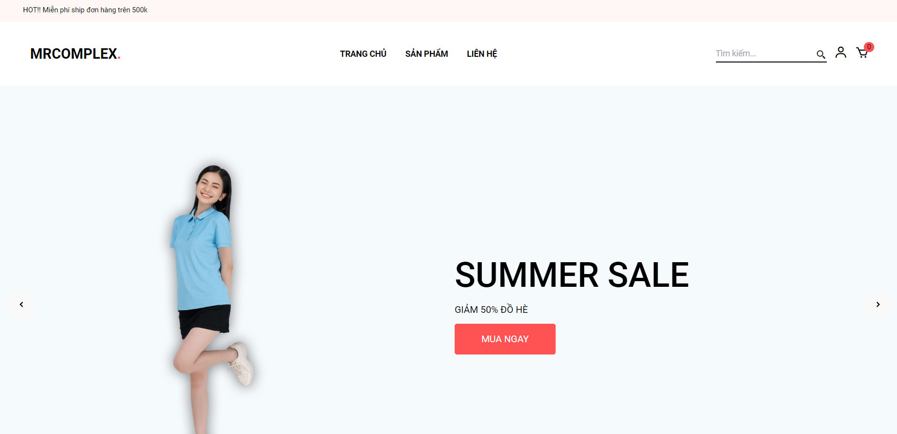
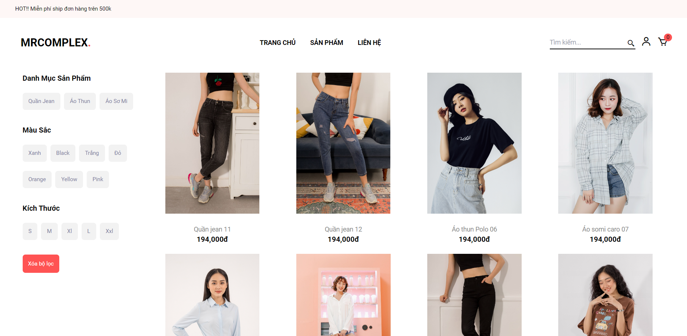

# MERN stack E-commerce Website

An ecommerce store built with MERN stack




<br>

_Live demo <https://mscomplex.onrender.com/>_

_Live demo admin <https://admin-mscomplex.onrender.com/>_

```
Admin account:
admin
123456
```

## Usage

- Create a MongoDB database and obtain your `MongoDB URI` - [MongoDB Atlas](https://www.mongodb.com/cloud/atlas/register)
- Create a Cloudinary account and obtain your `CLOUDINARY_NAME` `CLOUDINARY_API_KEY` `CLOUDINARY_API_SECRET` - [Cloudinary](https://cloudinary.com/users/register_free)


### Env Variables

Rename the `.env.example` file to `.env` and add the following

```
PORT=5000
MONGO_URI= your mongo uri
SECRET_KEY=
JWT_SECRET_KEY=
CLOUDINARY_NAME=
CLOUDINARY_API_KEY=
CLOUDINARY_API_SECRET=
```

Change the SECRET_KEY and JWT_SECRET_KEY to what you want

## Start development

```
npm run dev
```

## Technologies used

<p>
    
    
    
    
    
      
</p>

## Author

🎉 **Hoang Pham**
